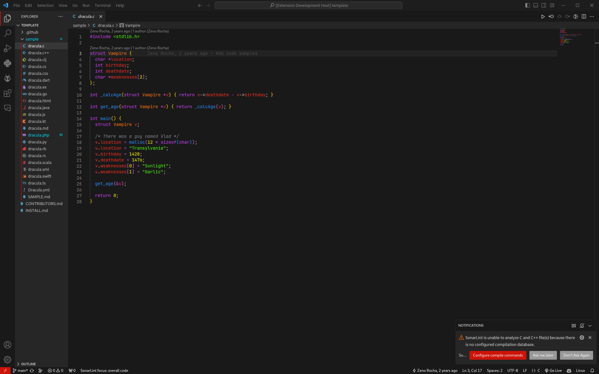

# Thinkpad for [VS Code](https://code.visualstudio.com/)

> A dark theme for [Visual Studio Code](https://foobar.com).

## Who maintains this theme...

|

|
|-|
| 
[0rteip](https://github.com/0rteip)
|

## License

[MIT License](./LICENSE)
